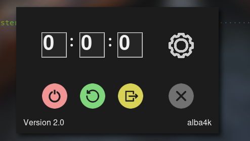

# Shutdown Timer
## by alba4k



Why are you even reading this though?

---

Features:
* ~~it sucks~~
* neat UI (hopefully)
*  Shutdown - Restart and logout in some time


Dependencies:
* git (cloning the directory)
* Python
* pyinstaller (to be installed with `pip install pyinstaller`)


Making an executable:
```bash
$ git clone https://github.com/alba4k/shutdown-timer
$ cd shutdown-timer
$ pyinstaller --onefile ShutdownTimer.py
```
a lot of useless stuff will appear, your executable will be in a new directory called dist

It can be moved, but it should always be in the same directory as the folder named "shutdown"


I woudld also like to thank Leonardo Preda for helping me to design a nice UI

---

Aaron Blasko, 2021-2022